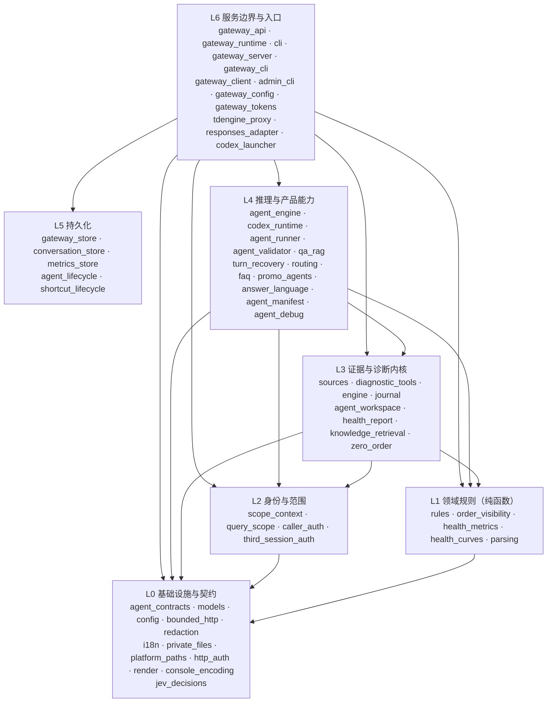
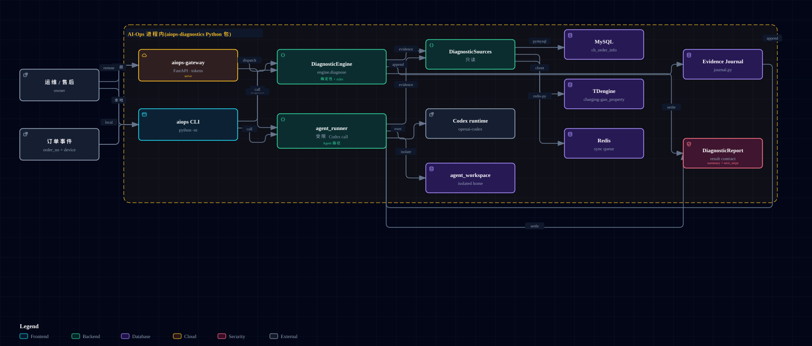

# AI-Ops

面向充电订单故障的**只读诊断系统**：把一句自然语言反馈变成一份有证据、可追溯、
不改变任何生产数据的诊断报告。

```text
订单 2079842220423700481 金额不对，帮我排查
```

> 第一次使用（安装 → 跑出第一份离线报告 → 连生产库 → 多端 Gateway）：
> 看 [快速上手](docs/快速上手.md)。
> 本 README 是**给接手这个仓库的人**看的：它解释系统为什么长这样、模块怎么分层、
> 依赖往哪个方向流、改一处代码要动哪些文件。

---

## 目录

- [一、这个仓库到底在做什么](#一这个仓库到底在做什么)
- [二、设计哲学](#二设计哲学)
- [三、系统模块与依赖关系](#三系统模块与依赖关系)
- [四、模块之间的契约（接缝）](#四模块之间的契约接缝)
- [五、运行入口](#五运行入口)
- [六、仓库地图](#六仓库地图)
- [七、改动指南：动哪里、读哪些文件](#七改动指南动哪里读哪些文件)
- [八、验证与交付纪律](#八验证与交付纪律)
- [九、当前边界与未验收事项](#九当前边界与未验收事项)
- [十、文档路由与历史遗留文件](#十文档路由与历史遗留文件)

---

## 一、这个仓库到底在做什么

仓库里有**两个互不相同的系统**，读之前必须分清，否则会把一半的文件当成无关噪音：

| 面 | 是什么 | 主要目录 |
|---|---|---|
| **产品面** | 只读诊断运行时 + 客服问答/知识库/健康报告的多端服务 | `src/aiops_diagnostics/`、`java/`、`ops/`、`packaging/` |
| **治理面** | 让 AI agent 自动完成「issue → 实现 → 审查 → PR」的可信交付流水线（AFK） | `.github/workflows/`、`.sandcastle/` |

两面共享同一套安全底线（凭据隔离、默认分支保护、确定性 CI），但**技术上没有调用关系**：
治理面产出的 PR 改的是产品面代码。本文档以产品面为主，治理面见
[第八节](#八验证与交付纪律) 与 [docs/afk-workflow.md](docs/afk-workflow.md)。

产品面的对外能力（Gateway 共 51 条路由）分四组：

- **诊断**：设备运行路径 `/v1/runs`（workspace 设备令牌）、标准 API
  `/v1/standard/diagnoses`（调用者身份委托）。
- **客服问答**：统一助手入口 `/v1/assistant/questions`（分流到固定问答 / 通用问答 /
  订单诊断 / 宣传案例）、固定问答 `/v1/faq/*`、知识库检索与媒体 `/v1/media/*`。
- **充电健康报告**：`/v1/health-report-jobs`（确定性规则实时计算，非故障根因判断）。
- **平台管理**：智能体与快捷动作的草稿/发布/停用生命周期、运行指标 `/v1/agent-metrics`。

---

## 二、设计哲学

这一节是本文档的核心。**下文每一个模块的存在理由，都可以回溯到这里的某一条推论**；
如果你要判断一处改动是否违背设计意图，也回到这里判断。

### 起点：三个不可协商的事实

1. **被诊断的系统承载资金与设备控制。** 充电订单关联计费、退款与结算；充电枪
   关联正在进行的物理过程。任何一次误写都不是数据问题，是钱和现场问题。
2. **业务方要的是解释，不是又一个能改数据的后台。** 故障的根因判断需要跨越订单、
   费用规则、设备时序、通讯报文和消息队列五类证据，这是人做起来很慢、模型做得还行的事。
3. **模型有推理能力，但没有可靠边界。** 它可能 hallucinate、可能凭空造出一张表名，
   可能在证据不足时给出高置信度结论，可能被提示词注入。

### 推论一：系统的正确形态是「只读的证据收集 + 解释」

事实 1 与 2 直接推出只读边界，并且这个边界必须写成**明文禁令**而不是"暂时没做"：

- 不提供 `UPDATE` / `DELETE` / `INSERT` / DDL、退款、重算、补发、消息重放、服务重启。
- 未来如果确实需要动作能力，**必须独立设计审批、权限与审计账本**，
  绝不能在诊断工具里顺手加一个写接口。
  见 [ADR-0001](docs/adr/0001-read-only-diagnostic-boundary.md)。

「只读」还不够严格——读也能压垮生产库。所以只读继续推出**有界**：

- 每次查询有超时、行数上限、时间窗口上限（`SafetySettings`，`config.py:309`）。
- TDengine 查询必须带设备、时间范围、选定列与 `LIMIT`；TDengine Community Edition
  不支持数据库级只读授权，因此生产查询必须经过 `ops/` 里 loopback-only 的
  **严格只读代理**（只识别本项目发出的精确有界语句）。
- Redis 用最小权限 ACL 用户，只允许 `XLEN/XINFO/XREVRANGE/TYPE/PING/INFO`。

### 推论二：既然模型不可信，边界必须由 harness 保证，而不是由提示词保证

这是本项目最重要的一次架构反转，叫 **thin harness（细管道）**：

> **模型不是被"管着"的工具，它是决策主体；harness 不决定因果结论，
> 它只保证模型的每个动作合法、有界、限定到租户与订单、进入日志、完成脱敏、可以恢复。**
> 见 [docs/thin-harness.md](docs/thin-harness.md)。

传统做法是「代码算出答案，模型负责措辞」；本项目反过来——**Codex 选择要哪些证据、
如何组合证据、给出因果解释**，Python 侧只做它必须做的事。为什么？因为事实 3 里的
"推理能力"是真能力，而事实 2 要求的跨五类证据的因果判断恰好是它的强项；
用提示词去约束它则是无效的（提示词是请求，不是保证）。

推论二在代码里落成五道**由 harness 执行的**硬边界，全部在 `agent_engine.py` 的
turn 循环周围：

| 边界 | 载体 | 保证什么 |
|---|---|---|
| 身份不可漂移 | `IncidentManifest`（`agent_contracts.py:36`） | 订单号/租户/意图/来源哈希在运行中冻结，改不了 |
| 动作有界可枚举 | `ToolName` 枚举 + `DiagnosticToolExecutor` | 模型只能点名 7 个预定义工具，**不能提交 SQL、不能选表** |
| 上限与恢复 | `RunState` + `AgentWorkspace` | turn 数、工具调用数、校验重试数封顶；`thread_id` 落盘，可 `agent-resume` |
| 证据可追溯 | `EvidenceJournal`（`journal.py`） | 每个工具结果存不可变 artifact + SHA-256，事件日志只记元数据 |
| 输出必须过合同 | `AgentResultValidator`（`agent_validator.py`） | 拒绝身份漂移、缺证据引用、只引 runbook 的结论、来源失败后的高置信度、密钥泄露 |

模型吐出的结构化输出还要过一层**容错解析**（`agent_engine.py:40`）：不同 provider
（GLM 等）会包 markdown fence、会丢掉 `kind` 判别字段、会把内层对象拍平。
这些差异在这里被归一化，而不是让每种 provider 的分支渗进业务逻辑。

### 推论三：一条业务规则只能有一处定义

第二个起点是**漂移**。最有力的证据是 `order_visibility.py` 的模块文档：
「哪个订单可以被这次运行看见」这条规则**曾经被独立实现六次**——两个入口守卫、
agent 工具层、三个数据源——并且**已经漂移了**：同一个订单，因入口不同会得到不同的
可见性结论和不同的失败原因。

因此该规则被收敛到一处定义、三种渲染（`order_visibility.py`）：

- `resolve_device_tenant()` — 入口渲染：运行的有效租户在此决定一次，请求不能放宽它。
- `visible_orders()` — 行级渲染：给手里已经握有行的调用方（fixture、工具层）。
- `scope_where_sql()` — 参数绑定 SQL 渲染：给能把规则下推进 SQL 的调用方。

**为什么必须是三种渲染而不是一种？** 因为设备路径从 HTTP 读订单（没有 SQL 可下推），
调用者路径直连数据库（有 SQL 可下推）。收敛点在**规则**，不在执行点。

这条推论还有一条更弱的通用形式：`rules.py` 与 `order_visibility.py` 被刻意写成
**只含纯函数与冻结值**，不含类层次、不含运行时状态、不引第三方依赖。规则是可测的
数据，不是对象。

### 推论四：失败是常态，所以运行必须可恢复

模型会因为额度欠费、超时、格式错误、进程中断而失败。把"运行"做成一个不可恢复的
内存对象，等于把外部不稳定变成内部数据丢失。所以：

- 每次运行有一个私有目录（`AgentWorkspace`，POSIX `0700`），`state.json` 记录
  phase/turn 计数/下一个 prompt；`events.jsonl` 事件**先落盘再推送**。
- **事件 sink 与人类进度显示是同一个源**——终端上看到的阶段，事后就能在
  `events.jsonl` 里追溯到，不需要两套记录互相对账。
- 恢复时校验 provider endpoint 一致（拒绝把已存 key 重定向到别的上游）、
  校验 fixture 哈希（恢复不能悄悄读到变过的测试数据）。

### 推论五：凭据不能到达客户端，所以有 Gateway

便携客户端不应该携带 MySQL、Redis、SSH 或 provider key。
把凭据留在固定服务器、客户端只拿一个设备令牌——见
[docs/gateway.md](docs/gateway.md)，以及 [ADR-0004](docs/adr/0004-bff-owns-frontend-api-boundary.md)。

同一原理在**用户身份**上重复一次：设备令牌不能代表用户，裸 `user_id`/`tenant_id`
不能作为授权依据。所以小程序侧由业务后端验证会话后签发一次性身份委托句柄，
AI-Ops 用独立服务身份回查——见 [ADR-0003](docs/adr/0003-bff-delegated-user-identity.md)。

### 推论六：成本与确定性要求保留一条不调用模型的路径

模型很贵、不稳定、不可复现，但 CI 需要可复现的回归基准。因此 `diagnose` 保留
`--mode deterministic` 分支（`engine.py`），它由已知规则与离线 fixture 驱动，
不需要 provider key，是 CI 与 fixture 回归的稳定锚点。

---

## 三、系统模块与依赖关系

### 3.1 分层

**先说结论，再说例外。** 本包实测**无环**（全量 AST 导入分析，含函数内延迟导入），
可以按下面的层理解；但它**不是严格的单向栈**——有 **6 条真实的向上依赖**，
全部列在表里。README 不会假装它们是"架构违规"：它们是低层模块为了服务某个窄场景
而引用高层的既有接缝，每条都有具体理由。



**层内为主，向下为主。** 同层内的引用（如 `agent_runner → agent_engine`、
`diagnostic_tools → sources`）是常态，不算异常。

#### 6 条向上依赖（真实存在，逐条有理由）

| 引用方（层） | 被引用（层） | 理由 |
|---|---|---|
| `caller_auth`（L2） | `sources`（L3） | `ScopedOrderAuthorizer` 需要**对着真实数据**判断调用者能否访问某订单，因此调用 `scoped_live_sources()`。授权判定本身是需要证据的。 |
| `diagnostic_tools`（L3） | `engine`（L3） | 同层，但值得记下：这里有一个**真实的封装缺陷**——它导入的是 `engine._order_window`，一个下划线私有名。复用是对的（时间窗口规则的唯一定义），但接口没有正式化。 |
| `journal`（L3） | `agent_workspace`（L3） | 同层协作：证据日志必须落到运行目录上，两者是同一层的两个面。 |
| `qa_rag`（L4） | `agent_lifecycle`、`shortcut_lifecycle`（L5） | 运行客服 QA 需要读"该租户当前已发布的智能体版本"——这是持久化层的职责。 |
| `agent_manifest`、`agent_debug`（L4） | `agent_lifecycle`（L5） | 声明式收敛与草稿调试都直接操作已发布版本存储。 |
| `shortcut_migration`（L4） | `shortcut_lifecycle`（L5） | 迁移的目标就是快捷动作存储，方向必然朝上。 |

**两条横向依赖（与推论三一致，不要"修正"）：**

1. **L3 证据层依赖 L2 身份层**（`sources.py`、`diagnostic_tools.py` 导入 `query_scope`）。
   因为范围必须作为参数绑定的谓词**下推进 SQL**，而不是取出数据再过滤。
2. **L2 身份层依赖 L1 规则层**（`scope_context.py` → `order_visibility`）。
   因为租户可见性是业务规则，不是技术细节。

**为什么 `agent_contracts.py` 在 L0 而 `agent_engine.py` 在 L4？**
契约被所有人导入（入度 12），编排只被 runner 导入。契约是共享词汇，编排是流程。

**为什么 `engine.py` 和 `agent_workspace.py` 在 L3？**
判据是**入度**而非直觉：`engine` 被 `diagnostic_tools` 与 `cli` 引用（作为 `known_runbook`
参考证据），`agent_workspace` 被 `journal` 与 `codex_runtime` 引用。把它们放低一层会让
向上依赖从 6 条增加到 8 条。分层是为理解服务的，不是为整洁服务的。

### 3.2 各层模块职责

#### L0 基础设施与契约

| 模块 | 职责 |
|---|---|
| `agent_contracts.py` | 推理面全部 Pydantic 契约：`IncidentManifest`、`AgentTurn`、`AgentDiagnosis`、`RunState`，以及 strict JSON-schema 生成 |
| `models.py` | 确定性面数据类：`DiagnosticRequest`、`DiagnosticReport`、`Evidence`、`Intent`、`Severity` |
| `config.py` | 全部配置的单一来源：`Settings` 及嵌套 `*Settings`，含 `SafetySettings`（上限）与 `AgentSettings`（provider 注册表） |
| `bounded_http.py` | 所有出站 HTTP 的**唯一**骨架：请求构造 → 认证头 → `urlopen` → 异常分类 → 信封解析。各调用点以声明式参数注入自己的错误类、认证方式与重试策略，差异显式可见 |
| `jev_decisions.py` | Jev 决策客户端（PRD #383）：发送类型化问题（`choice`/`noul`/`score`），取回**带概率的类型化判定**而非生成文本——判定路径因此不再需要先让模型生成 JSON 再解析。**必须显式设置 User-Agent**：网关 WAF 会以 403 拒绝 urllib 的默认 agent，形态酷似限流或认证失败 |
| `redaction.py` | `redact_text` / `sanitize_data` / `contains_secret` |
| `i18n.py` | `Accept-Language` 解析、语言表、`chinese_leak` 判定。**纯头部解析**，结果只用于呈现，不得改变权限或路由 |
| `private_files.py` | 私有目录/文件创建与权限加固（POSIX `0700`/`0600`，Windows 当前用户 DACL） |
| `platform_paths.py` | 平台私有路径解析：`config_root`、`data_root`、`reference_root`（开发态指向仓库、冻结态指向 `_bundle`） |
| `http_auth.py` | HMAC-SHA256 `X-Internal-Token` 签发与校验，与 Java 侧 `InternalTokenManager` 兼容 |
| `console_encoding.py` / `render.py` | Windows stdio UTF-8 兜底 / Rich 渲染 |

#### L1 领域规则（纯函数，无状态、无依赖）

| 模块 | 职责 |
|---|---|
| `rules.py` | 停止原因分类、服务端/桩端计费判定、状态标签 |
| `order_visibility.py` | **租户可见性规则的唯一定义**，三种渲染（见推论三） |
| `health_metrics.py` / `health_curves.py` | 充电健康指标计算与曲线降采样 |
| `parsing.py` | `parse_request`：自然语言 → 结构化请求。**只提取订单号与意图**，不接受 SQL、不选表 |

#### L2 身份与范围

| 模块 | 职责 |
|---|---|
| `scope_context.py` | 把一次运行的授权输入收敛为不可变 `ScopeContext`：调用者、目标主体、有效租户、业务数据范围。平台依赖经 `PlatformDirectory` 单一接缝接入。**解析器不持有任何数据源**，全部 fail closed |
| `query_scope.py` | 把 `ScopeContext` 解析成可直接下推的不可变 `QueryScope`（tenant / site_ids / user_id），站点范围来自 UPMS 数据范围、Dis 点位归属，或运营商维度（B 端主体 → 店铺集合 → 站点归属，PRD #423） |
| `caller_auth.py` | 调用者身份接缝：`CallerContextResolver`（UPMS / OAuth2 introspection / fail-closed 禁用）与 `OrderAuthorizer` |
| `third_session_auth.py` | C 端 `thirdSession` → `ScopeContext` 的 Redis 解析路径；身份同时带 C 端 id 与经既有 C→B 映射端点补全的 B 端 `sys_user.id`，解析不出唯一主体时记录可区分原因 |

#### L3 证据与诊断内核

| 模块 | 职责 |
|---|---|
| `sources.py` | `DiagnosticSources` 协议 + 全部实现（见 [4.1](#41-证据源接缝)）。**最大单文件（1550 行）** |
| `diagnostic_tools.py` | `DiagnosticToolExecutor`：模型可点名的 7 个工具在此落地；含 `preflight_environment` 环境预检（advisory） |
| `engine.py` | `DiagnosticEngine`：确定性规则诊断（`--mode deterministic`）。**同时被 `diagnostic_tools` 复用来提供 `known_runbook` 参考证据** |
| `journal.py` | `EvidenceJournal`：追加式证据日志，每个结果存 artifact + SHA-256 |
| `agent_workspace.py` | 运行目录的磁盘契约：manifest/state/result/events，run_id 创建 |
| `health_report.py` | 最小健康报告装配，带更窄的 `OrderSource` 协议 |
| `knowledge_retrieval.py` | 有界知识检索与媒体签发：`KbServiceClient`、`KnowledgeSearchGuard`、`MediaResourceSigner`、`MediaProxy` |
| `zero_order.py` | 零订单工具集的**默认拒绝**白名单边界（当前白名单为空集）。任何订单相关工具在到达数据源前就被拦下 |

#### L4 推理与产品能力

| 模块 | 职责 |
|---|---|
| `agent_engine.py` | **`AgentCoordinator`：整个 agent 路径的心脏。** turn 循环、跨 provider 容错解析、工具分发、合同修复循环、完成/阻断终态 |
| `codex_runtime.py` | `CodexSession` 协议 + `SDKCodexSession`（openai-codex SDK）、隔离 runtime home、provider key 解析、心跳 |
| `agent_validator.py` | `AgentResultValidator`：输出侧合同校验 |
| `agent_runner.py` | CLI 与 Gateway 共用的入口：`run_agent_diagnosis` / `run_zero_order_answer` / `classify_lightweight` |
| `qa_rag.py` | 客服 QA 的 RAG 运行：在 Codex harness 里跑已发布智能体 + `knowledge_search`，产出 blocks-v1 合同 |
| `turn_recovery.py` | 传输层模型轮次的宽容解析：围栏 / 最外层 `{}` / **首部丢失修复**（providers 的 SSE 首个 delta 会被上游丢弃，2026-09-22 实测 5/6） |
| `routing.py` | 路由判定（PRD #383）：把 Jev 的**类型化判定**翻成 `intent`/`risk`/`confidence`，六个 `intent` 字符串与旧模型逐字相同。取不到判定时**返回 None 而非失败**（路由只是优化），失败带错误码、可计数、日志可见（该组件曾静默失效过一次）|
| `faq.py` | 平台隔离的固定问答目录与平台身份判定（`consumer` / `operator`） |
| `promo_agents.py` | 宣传案例/方案路由：跑租户已发布的宣传智能体，与客服 FAQ 智能体隔离 |
| `answer_language.py` | 回答面输出语言校验的**共享应用点**（挂到各回答面的定稿点） |
| `agent_manifest.py` / `agent_debug.py` | 声明式环境清单收敛 / 草稿调试与真实知识绑定校验 |
| `shortcut_migration.py` | 租户复制快捷动作 → 平台默认的幂等迁移 |

#### L5 持久化（同一个 SQLite 文件，各自建表）

| 模块 | 职责 |
|---|---|
| `gateway_store.py` | 设备/注册码/run/事件/提问/健康报告作业/标准诊断 |
| `conversation_store.py` | 会话与活跃订单上下文（最近 8 轮或 8k token，保留 30 天） |
| `metrics_store.py` | 脱敏运行指标。**按构造脱敏**：只存租户/路由/计数/延迟，不存问题与答案正文 |
| `agent_lifecycle.py` | 智能体草稿与不可变已发布版本（租户隔离） |
| `shortcut_lifecycle.py` | 产品快捷动作草稿与不可变版本（平台默认 + 租户覆盖） |

#### L6 服务边界与入口

| 模块 | 职责 |
|---|---|
| `gateway_api.py` | FastAPI 应用工厂 + **全部 51 条路由** + 请求/响应 schema。**最大单文件（2771 行）** |
| `gateway_runtime.py` | Gateway 的服务端编排核心：持有数据库凭据、Codex session、线程池，执行 run / QA / 健康报告 / 标准诊断 |
| `cli.py` | Typer 根应用 `aiops`：`init`/`key-install`/`paths`/`diagnose`/`doctor`/`shell`/`agent-resume`/`agent-doctor`，并挂载 `admin` 与 `remote` 子应用 |
| `gateway_server.py` | `aiops-gateway`：`serve`、一次性注册码签发、设备管理 |
| `gateway_cli.py` / `gateway_client.py` | `aiops remote …` 客户端子应用与它的 stdlib HTTP 客户端 |
| `gateway_config.py` / `gateway_tokens.py` | Gateway 服务端设置与客户端 profile/令牌的磁盘持久化 |
| `admin_cli.py` | `aiops admin …`：声明式环境清单收敛（`reconcile`）、快捷动作迁移 |
| `tdengine_proxy.py` | `aiops-tdengine-proxy`：TDengine 前的严格只读 SQL 白名单代理 |
| `responses_adapter.py` | `aiops-responses-adapter`：修复上游 Responses API 的两个兼容缺口（缺失 item `status`、grammar 与 tools 冲突），对客户端完全透明 |
| `codex_launcher.py` | Codex 二进制 exec 包装（清洗环境变量后 `execve`） |

### 3.3 数据/配置文件

| 文件 | 内容 | 谁读 |
|---|---|---|
| `src/aiops_diagnostics/faq_catalog.json` | 固定问答正式目录（中文权威 + `en/de/fr/es/pt` 五种翻译） | `faq.FAQCatalog.bundled()` |
| `src/aiops_diagnostics/faq_recommendations.json` | 各平台/语言的推荐展示清单（不含答案） | 同上 |
| `examples/fixtures/*.json` | 三份离线合成 fixture（YKC 金额不一致 / OCPP 正常 / 交易数据缺失） | `FixtureSources` |
| `ops/environments/<env>.toml` | 某环境期望的已发布智能体清单 | `aiops admin reconcile` |

---

## 四、模块之间的契约（接缝）

这一节回答第三个问题：**高层模块与底层设计决策之间靠什么连接**。
每一次"这里可以换一种实现"都是一个接缝；接缝下面是 ADR 记录的决定。

### 4.1 证据源接缝

**协议**：`DiagnosticSources`（`sources.py:64`），8 个方法。
**实现**（都是鸭子类型，结构上满足协议）：

| 实现 | 什么在变 |
|---|---|
| `MySQLSource` / `TDengineSource` / `RedisSource` | 三种直连后端，各自带范围下推或设备/Stream 白名单 |
| `HttpSources` | 改为调用远端 `/diag/*` HTTP 契约（**当前已降级为回退路径**） |
| `HybridSources` | 混合：订单/设备/Stream 走 HTTP，TDengine 直连 |
| `ScopedSources` | 全部直连且受一个 `QueryScope` 约束；TDengine 的设备集合由订单元数据经 `DeviceGate` seed，未 seed 即拒绝 |
| `LiveSources` | 全直连组合 |
| `FixtureSources` | 离线 JSON 回放 |

**工厂接缝**（都是 context manager，负责按需建立 SSH 隧道）：
`direct_sources()`、`live_sources()`、`scoped_live_sources()`。

> ⚠️ **两个源集合并存，这不是历史包袱而是推论三的必然结果。**
> 标准 API 面携带 `QueryScope`，走 `ScopedSources`，租户以参数绑定谓词下推；
> 设备运行路径不携带范围对象（没有 SQL 可下推），落到 `HybridSources`，租户由工具层按行过滤。
> 一个租户规则、两种渲染。**不要试图合并它们**——合并意味着要么给设备路径伪造一个它没有的
> 范围对象，要么放弃 SQL 下推。
> 现状注记：`.env.example` 已把 `/diag/*` HTTP 段标记为 DEPRECATED（PRD #23，2026-08-31），
> `live_sources()` 仍返回 `HybridSources`，因此**对外提供设备诊断的部署仍需 HTTP 段配置**。

### 4.2 推理接缝

| 接缝 | 协议/注入点 | 允许替换什么 |
|---|---|---|
| `CodexSession` | `codex_runtime.py:113`；经 `AgentCoordinator.session_factory` 注入 | 跑 turn 的模型 harness（生产是 `SDKCodexSession`，测试可注入假实现） |
| `KnowledgeBindingResolver` | `agent_lifecycle.py` | 发布前知识库绑定能否校验（默认 fail closed 的 `Unavailable…`） |
| `KnowledgeSearchClient` | `knowledge_retrieval.py` | 知识库检索后端 |
| `SessionFactory` / `ProgressCallback` | `agent_engine.py:34` | 会话构造与进度外送 |

### 4.3 身份与授权接缝

| 接缝 | 协议 | 实现（按配置选择） |
|---|---|---|
| `CallerContextResolver` | `caller_auth.py` | `Disabled…`（fail closed 默认）/ `Upms…`（公司 Bearer）/ `Introspection…`（RFC 7662 令牌自省，强制 HTTPS 与 audience） |
| `OrderAuthorizer` | `caller_auth.py` | `Disabled…` / `ScopedOrderAuthorizer` |
| `PlatformDirectory` | `scope_context.py` | `UpmsDirectory` |
| `SiteScopeMapper` / `DisDirectory` | `query_scope.py` | 静态映射 / `DisHttpDirectory` |
| `BSubjectDirectory` | `third_session_auth.py` | `UpmsBSubjectDirectory`（C 端用户 → B 端主体，会话身份补全） |
| `ShopDirectory` | `query_scope.py` | `UpmsShopDirectory`（B 端主体 → 店铺集合，与后端权威授权同一端点） |
| `OperatorSiteScope` | `third_session_auth.py` | `UpmsOperatorSiteScope`（运营商站点集合，管家端会话的数据范围） |

生成物是冻结的 `ScopeContext`，其 `scope_fingerprint` 是下游所有存储与授权的键。

### 4.4 Gateway 存储接缝

`GatewayStore` **没有 Protocol**，接缝是鸭子类型 + 构造注入
（`create_gateway_app(store=…)`、`GatewayRuntime(store, …)`）。
同一个 SQLite 文件上挂了五个 store，各自建表；`GatewayStore` 的类文档写明
「接口留待日后迁移到 PostgreSQL」。

### 4.5 与底层设计决策的映射

| 决策 | 落在哪些模块 |
|---|---|
| [ADR-0001](docs/adr/0001-read-only-diagnostic-boundary.md) 只读诊断边界 | `diagnostic_tools.py`（工具白名单）、`sources.py`（有界查询）、`config.SafetySettings`、`ops/` 代理、`zero_order.py` |
| [ADR-0002](docs/adr/0002-trusted-pr-control-plane.md) 可信 PR 控制面 | `.github/workflows/agent-*.yml`、`.sandcastle/policy-check.mjs`、`.sandcastle/trusted-pr-delivery.sh` |
| [ADR-0003](docs/adr/0003-bff-delegated-user-identity.md) BFF 委托用户身份 | `caller_auth.py`、`scope_context.py`、`third_session_auth.py`、`gateway_api.py` 的 `authenticated_caller` |
| [ADR-0004](docs/adr/0004-bff-owns-frontend-api-boundary.md) BFF 拥有前端接口边界 | `gateway_api.py` 的标准 API 面、`docs/standard-api-contract.md` |
| [ADR-0005](docs/adr/0005-codex-mediated-knowledge-retrieval.md) Codex 中介知识检索 | `knowledge_retrieval.py`、`qa_rag.py`、`agent_contracts.qa_rag_turn_schema` |
| [ADR-0006](docs/adr/0006-shortcut-actions-extend-to-in-app-navigation.md) 快捷动作分两种形态 | `shortcut_lifecycle.py`、`gateway_api.py` 快捷动作路由 |
| [ADR-0007](docs/adr/0007-answer-surface-language-guard.md) 回答面语言校验 | `answer_language.py`、`i18n.py`（判定），挂点在各回答面定稿处 |

---

## 五、运行入口

`pyproject.toml` 声明四个 console script，对应四条独立的进程边界：

| 命令 | 入口 | 起什么 |
|---|---|---|
| `aiops` | `cli.py:app`（Typer） | 工程师本地诊断：`diagnose` / `doctor` / `shell` / `agent-resume` / `agent-doctor` / `init` / `key-install` / `paths`，并挂 `admin` 与 `remote` 子应用 |
| `aiops-gateway` | `gateway_server.py:main` | 多端服务：`serve` 起 uvicorn 承载 51 条路由；`issue-enrollment` / `devices` / `revoke-device` 管设备 |
| `aiops-tdengine-proxy` | `tdengine_proxy.py:main` | loopback-only 的 TDengine 严格只读代理 |
| `aiops-responses-adapter` | `responses_adapter.py:main` | Responses API 兼容反向代理 |

`python -m aiops_diagnostics` 走 `__main__.py`，并在 argv 含 `__codex-launcher` 时转给
`codex_launcher:main`（冻结产物里 Codex 子进程的重入点）。

### 一次诊断的调用链（agent 路径）

```text
cli.diagnose → parsing.parse_request
             → Settings.from_config → incident manifest → AgentWorkspace.create
             → agent_runner.run_agent_diagnosis
                 ├─ _agent_sources()  → FixtureSources | scoped_live_sources | live_sources
                 ├─ EvidenceJournal + DiagnosticToolExecutor + preflight_environment
                 └─ AgentCoordinator.run()
                        ├─ SDKCodexSession.run(prompt)          ← 模型决定要什么证据
                        ├─ tools.execute_many(tool_requests)    ← harness 执行有界只读查询
                        ├─ journal.record(...) + artifact SHA   ← 证据落盘
                        └─ AgentResultValidator.validate(...)   ← 输出过合同
             → render.render_agent_diagnosis
```

### 一次 Gateway 请求的调用链

```text
gateway_api 路由 → CallerContextResolver.resolve → ScopeContext
                 → GatewayRuntime.start_*()  → 落库 + ThreadPoolExecutor.submit
                 → _execute_*  → scoped_live_sources(scope) → run_agent_diagnosis
                 → store.update_*（终态） + 事件序列
```

---

## 六、仓库地图

```text
src/aiops_diagnostics/    产品面 Python 全部代码（L0–L6）
tests/                    77 个测试文件，按关注点平铺（无 conftest）
java/                     充电桩后端侧的 /diag/* 查询接口与审计切面工件 —— 见下方警告
ops/                      TDengine 只读代理的 systemd 单元与环境清单
packaging/                PyInstaller 规格与便携包构建 + 烟测
tools/                    数据生成器（合成验收数据、FAQ 目录与多语言合并）
examples/                 离线 fixture 与合成验收数据
docs/                     架构、契约、ADR、运行手册（见第十节路由表）
.github/workflows/        确定性 CI + AFK 治理面流水线
.sandcastle/              AFK 执行层（TypeScript 编排、静态策略、投递状态机）
AGENTS.md                 仓库级开发共识（中文文档、里程碑同步、业务边界）
CONTEXT.md                领域词汇表（术语 + 应避免的同义词）
SOP.md / 充电桩问题排查SOP.md   业务规则来源（后端行为的中文说明）
acceptance.feature        Gherkin 可执行验收约束（29 Feature / 73 Rule / 195 Scenario）
qa-plan.md                QA 用例（136 个用例 ID，含环境/前置/数据/动作/预期/清理）
```

> ⚠️ **`java/` 是待落地工件，不是本仓库构建产物。**
> 本仓库没有 JDK/Spring 工具链，这两个文件没有被编译、没有被部署。它们的生产归宿是
> 充电桩后端仓库（见 [java/README.md](java/README.md)）。仓库内只有四个 Python 契约测试
> 守护其对外形状，**这不等于真实验收**。

---

## 七、改动指南：动哪里、读哪些文件

| 我想… | 先读 | 主要改动点 | 注意 |
|---|---|---|---|
| 加一条诊断业务规则 | `rules.py`、`engine.py` | `rules.py`（纯函数）+ 必要时 `engine._finalize` 的分类优先级 | 规则来源必须是后端源码或 SOP，不能凭直觉；置信度阶梯要同步 |
| 加一个只读证据工具 | `diagnostic_tools.py`、`agent_contracts.ToolName` | `ToolName` 枚举 + `TOOL_DESCRIPTIONS`/`TOOL_SOURCES` + executor 分支 | 必须同时修改零订单白名单判断（默认拒绝），并补 fixture 与测试 |
| 改租户/站点可见性 | `order_visibility.py`（先读模块文档） | 只改这一处；三种渲染会一起生效 | **绝对不要**在入口或数据源里另写一份过滤——这正是六次重复的由来 |
| 换模型 provider 或加 key slot | `docs/thin-harness.md`、`config.AgentSettings` | 环境变量注册表（`AIOPS_PROVIDERS` 等） | 不改代码即可切换；跨 provider 的格式差异在 `agent_engine._parse_agent_turn` 归一化 |
| 加一条 Gateway 路由 | `gateway_api.py`、`gateway_runtime.py` | 路由 + 请求模型 + runtime 执行方法 + store 表 | 权限必须经 `ScopeContext`，不能从请求体取 `user_id`/`tenant_id` 当授权依据 |
| 加一项持久化 | `gateway_store.py` 等 | 在既有 SQLite 文件上建自己的表 | 迁移到 PostgreSQL 时需一并处理 |
| 改输出语言行为 | `i18n.py`（判定）、`answer_language.py`（应用） | 挂到目标回答面的**定稿点** | 判定只有一处；不要用提示词兜底（ADR-0007 明文禁止） |
| 调安全上限 | `config.SafetySettings` | 构造时校验区间 | 上限是设计的一部分，放宽需说明理由 |
| 改 AFK 交付流程 | `.sandcastle/policy-check.mjs`（先读它的断言） | workflow + policy check 同步改 | policy check 是静态断言，改 workflow 不改它会让 CI 红 |

---

## 八、验证与交付纪律

### 确定性检查（唯一强制门）

[`.github/workflows/ci.yml`](.github/workflows/ci.yml) 一个 job，GitHub-hosted：

```bash
uv sync --locked --dev
uv run ruff check . && uv run ruff format --check .
uv run pytest -q
uv run python -m compileall -q src tests && uv pip check
```

### 持续部署（[:cd.yml](.github/workflows/cd.yml) + [:deploy/deploy-41.sh](deploy/deploy-41.sh)）

CI 保证「合并进来的东西是对的」，CD 负责「把它送到 41 上跑」。触发条件是
`main` 上 `src/**` 的改动（纯文档合并不部署，也不该占用人审批的注意力）。

```
push main (src/**) → cd.yml → environment: production-41（人工审批门）→ deploy-41.sh
```

四个设计选择，每个都有具体理由：

1. **部署逻辑只在 `deploy-41.sh` 里**。runbook §2 是同一套步骤的散文版；两处各写一遍
   必然漂移（§2 的 tar/rsync 配对 bug 就是这么来的）。脚本是自动化与手工应急的唯一共同实现。
2. **走 `dev-host`，不自造 ssh+rsync**。`dev-host` 已实现策略要求的门：主机公钥身份断言、
   写入服务主机需要 `--artifact-sha256`（载荷 sha 与声明不符即拒，退出 77）。
   自己写一套传输就等于绕开「变更只能作为已识别产物到达服务主机」。
3. **CD 用独立 ssh 别名 `aiops-41-cd`（独立密钥）**，人工仍用 `aiops-41`。
   这样自动写入可独立吊销而不影响人工路径，41 的 `authorized_keys` 也能区分来源。
   `deploy-41.sh` 不往主机清单里加第二条 41 记录（那会制造两份角色记录），
   而是**运行时从主清单派生**一份视图、只替换 `ssh_alias`，并断言其余字段一致。
4. **部署后断言 `/health` 含本次 commit**。`/health` 的 `version` 原先是个静态
   `0.1.0`，无法回答「现在跑的是哪个 commit」——回滚也就无从验证。脚本在**暂存副本**上
   把 `__init__.py` 的 `__version__` 写成 `<semver>+<short-sha>`（不动工作树），
   于是部署后可断言、回滚后可确认。

**CD 只证技术健康，不证业务验收。** 真实端到端需要业务方签发的 thirdSession，
runbook §5/§6 明确禁止 CI 自证。所以 CD 通过最多报告 `merged_waiting_deploy`；
`live` 仍须人按 §5 执行。

### 测试组织

`tests/` 是 77 个平铺文件的集合，按关注点聚类：
`test_assistant_*`（助手面）、`test_standard_*`（标准 API 契约）、
`test_diag_*_contract`（每个 `/diag/*` 端点的契约）、`test_*scope*`（权限栈）、
`test_agent_*`（agent 运行时）、`test_readme_architecture.py`（**本文档自身的形状守护**——见下）。
最新本地全量记录为 **1082 passed**；当前数字以
[docs/validation.md](docs/validation.md) 为准。

**README 自身有守护。** 本文件声称「每个模块都在这儿被解释」以及「包内无环」，
两条都是可机检的，所以它们由 `tests/test_readme_architecture.py` 断言：
模块必须被说明、README 引用的模块必须存在、相对链接必须可解析、包内必须无导入环。
文档漂移会让 CI 变红——而不是等下一个接手者踩坑。
（守护只查形状，不查措辞是否讲清楚了。）

> 已知缺口：`admin_cli.py` 与 `gateway_server.py` 没有专门的测试文件——
> `serve` 装配、注册码签发、设备管理、清单收敛命令未被单元测试覆盖。

### 文档与证据纪律

1. **每个可交付里程碑**必须同步 `docs/开发进度.md` 与 `docs/validation.md`，
   变更用户入口/配置/部署/安全边界时还要同步 README 与对应架构部署文档。
2. **证据分级不许混用**：自动化测试、生产只读回放、真实 provider 调用、便携包验收、
   工程师确认的真实故障结论是五件不同的事。没有后者时必须明确写「未完成业务验收」，
   **不得**把 fixture 或模型调用写成真实故障结论。
3. **契约测试守护文档形状**：例如取消契约的 7 个响应样例由
   `tests/test_assistant_cancel_handoff.py` 在真实网关栈上抓取——**文档漂移即测试失败**。

### AFK 治理面

`issue → 实现 → 审查 → PR` 的自动流水线，信任边界为
[ADR-0002](docs/adr/0002-trusted-pr-control-plane.md)：只接受仓库所有者创建的**同仓库**分支；
宿主从当前 `main` 加载可信 controller，候选代码只在 Docker 沙箱内以**只读 token** 执行；
结果经 Git bundle 导入干净 delivery checkout 后才使用短时写 token 推送；凭据缺失即 fail closed。
流程与阶段边界见 [docs/afk-workflow.md](docs/afk-workflow.md)。

---

## 九、当前边界与未验收事项

**这个系统目前没有工程师确认的真实故障结论。** 自动化测试、生产只读回放、
真实 provider 调用和便携制品验收只能证明**实现一致性**与**运行边界**，
不能替代业务准确性验收。

- 每个受支持的故障路径都需要至少 3 个工程师确认的真实故障案例，
  逐项比对系统给出的摘要、分类、证据与下一步建议。**即使建议恰好正确，
  一个错误的高置信度结论仍算失败。** 待验收路径清单见
  [docs/validation.md](docs/validation.md) 的「业务验收待办」。
- 已知未验收：41 公网停止链路与 `/v1/agent-metrics` 聚合面；
  `health_report_jobs` / `standard_diagnoses` 的重启收敛；
  五种语言的真实调用（en/de/fr/es/pt，等待可用 thirdSession）；
  真实外部贡献者的 fork PR 执行路径。
- 第一版**明确不支持**两轮车完整规则（标记 `unsupported_order_type` 并降低置信度）。
- 业务动作面**关闭**：不提供重算、退款、补发、改单、改配置、消息重放、消费游标、重启服务。
- Gateway 是**单节点 MVP**，适合内网与受控验收；公网生产前必须完成
  TLS、OIDC/mTLS、Vault/KMS、PostgreSQL、速率限制、审计与撤销——
  见 [docs/gateway.md](docs/gateway.md)。

---

## 十、文档路由与历史遗留文件

**先读这几份，它们是当前的权威来源：**

| 你要回答 | 读 |
|---|---|
| 现在到哪一步了？ | [docs/agents/current-delivery-state.md](docs/agents/current-delivery-state.md) + [docs/validation.md](docs/validation.md) 首节 |
| 某个历史决定为什么这么做？ | [docs/adr/](docs/adr/) |
| 某个术语到底指什么？ | [CONTEXT.md](CONTEXT.md)（词汇表，不含规格） |
| 对外接口契约？ | 固定问答 [docs/faq-api.md](docs/faq-api.md)；健康报告与单问诊断 [docs/standard-api-contract.md](docs/standard-api-contract.md)（**冲突时以这两份为准**） |
| 怎么跑起来？ | [docs/快速上手.md](docs/快速上手.md) |
| 系统架构简述？ | [docs/architecture.md](docs/architecture.md) |
| agent 运行时细节？ | [docs/thin-harness.md](docs/thin-harness.md) |
| 多端部署？ | [docs/gateway.md](docs/gateway.md) |
| 里程碑历史？ | [docs/开发进度.md](docs/开发进度.md) |

**历史遗留文件（保留但不代表当前状态，不要据此判断）：**

- `docs/handoff-brief.md`、`docs/afk-cutover/*` — 某次交切的会话快照，相关工作已完成。
- `docs/qa-plan-real.md`、`docs/real-acceptance-results.md`、`docs/synthetic-acceptance-data.md`
  — 某一时点的验收记录，已被 `docs/validation.md` 取代。
- `docs/architecture/ai-ops-architecture.*` — 架构图快照；生成规格在同目录 `.json`。
- `docs/原型/`、`docs/知识库材料/`、`docs/用户端.docx`、`docs/管家端.docx`、`scripts/`
  — 已被 `.gitignore` 忽略，不进入仓库。

> 判断一份文档是否仍权威，看有没有**入链**：被 `AGENTS.md`、本 README 或
> `current-delivery-state.md` 指向的是权威；孤立的多半是快照。

---

## 架构图



运行时架构可视化：[PNG](docs/architecture/ai-ops-architecture.png) ·
[SVG](docs/architecture/ai-ops-architecture.svg) ·
[可交互 HTML](docs/architecture/ai-ops-architecture.html)（含主题切换、平移缩放、视图聚焦、关系追溯）。
生成规格见 [`docs/architecture/ai-ops-architecture.json`](docs/architecture/ai-ops-architecture.json)。
