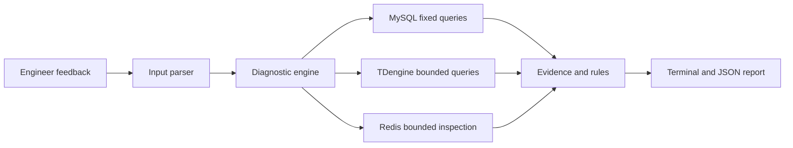

# Architecture

## Runtime Flow

The language-facing layer only extracts the order number and problem intent. It cannot submit SQL, select arbitrary tables, or invoke business actions. The engine owns the runbook and calls fixed read-only adapters.

## Backend-Derived Rules

The initial rules were derived from the supplied backend snapshot:

- Order status: `CommonConstant` and `ChOrderInfo` define status 2 as uncontrollable exception, 3 as handled exception, and 5 as a reported but abnormal end.
- Transaction matching: OCPP orders use `transaction_id`; most other protocols use the order number, while the final TDengine correlation value is taken from `tx_data.txSerialNo` when present.
- Billing side: `FourPriceComputeComponent` uses server billing for OCPP and AYK, and pile billing for other protocols.
- Pile billing: platform electricity fee is calculated from period electricity and the fee template; service fee is `max(tx_data.totalFee - electricity_fee, 0)`.
- Total amount: `ChOrderInfo.collectFee()` sums electricity fee, service fee, launch fee, park fee, electric-loss electricity fee, and electric-loss service fee.
- YKC abnormal end: codes 64-73 are treated as normal end; other reported codes are generally marked status 5.

## Deployment Boundary

The project can run directly on a permission-scoped diagnostics host or through OpenSSH local forwarding. SSH password automation is intentionally unsupported; production should use a dedicated account and key with restricted forwarding destinations.

TDengine Community Edition 3.4 does not implement `GRANT READ`, and a non-superuser can write to an
existing database. Production therefore routes TDengine requests through the loopback-only proxy in
`ops/`. The proxy recognizes only the exact bounded queries emitted by `TDengineSource`; the SSH account
cannot forward directly to TDengine's native REST port.

## Required Production Identities

- MySQL account: SELECT only on explicit diagnostic tables and views.
- TDengine proxy backend account: localhost only, with `CREATEDB 0` and `SYSINFO 0`; its write-capable
  credential is held only by the strict read-only proxy because Community Edition lacks database grants.
- Redis account: read-only ACL limited to the two order synchronization streams and required metadata commands.
- SSH account: no shell administration rights; port forwarding limited to approved database endpoints.
