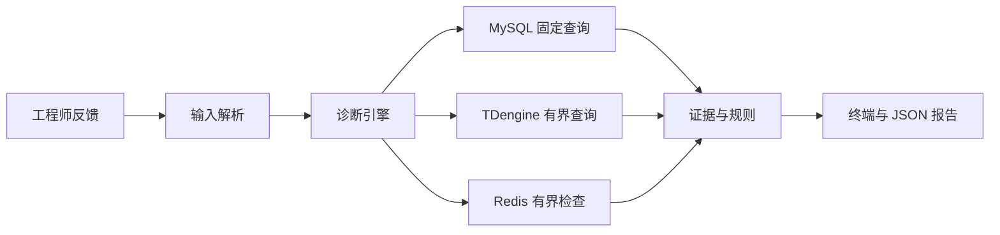

# 系统架构

## 确定性快速路径

面向自然语言的层只提取订单号和问题意图，不能提交 SQL、选择任意表或调用业务动作。诊断引擎掌握确定性 runbook，并调用固定的只读适配器。

## Codex-native Thin Harness

第一版 agent 路径反转了决策边界：持久 Codex thread 请求受限的证据工具，读取运行目录中暂存的 SOP 和业务参考，负责选择假设并给出因果解释。harness 只保留不可变身份、只读上限、证据哈希、脱敏、置信度上限、结果验证和恢复状态。详见 [thin-harness.md](thin-harness.md)。

## 基于后端的业务规则

初始规则来自用户提供的后端快照：

- 订单状态：`CommonConstant` 和 `ChOrderInfo` 定义状态 2 为不可控异常、3 为异常已处理、5 为设备已上报但异常结束。
- 交易匹配：OCPP 使用 `transaction_id`；AYK、YKC 和其他非 OCPP 协议使用订单号，符合后端事件查询路径。
- 计费侧：`FourPriceComputeComponent` 对 OCPP 和 AYK 使用服务端计费，其他协议使用桩端计费。
- operator 订单：`launch_type=operator` 绕过标准停止充电计费流程，直接用 `tx_data.totalFee` 检查订单总额，不套用费率模板和标准结算检查。
- 桩端计费：平台电费根据分时电量和费率模板计算；服务费为 `max(tx_data.totalFee - electricity_fee, 0)`。
- 订单总额：`ChOrderInfo.collectFee()` 汇总电费、服务费、启动费、停车费、电损电费和电损服务费。
- YKC 异常结束：64-73 视为正常结束，其他设备上报码通常标记为状态 5。
- 交易完整性：可解析的 `tx_data` 视为已收到证据，即使独立接收标志不一致；充电订单结束前不强制要求交易结束数据。
- 两轮车订单：当前版本标记为不支持并降低置信度，不套用四轮车计费和枪时序规则。
- 置信度：证据源失败、跳过或金额快照缺失都会降低置信度，不能用残缺证据链报告高确定性。

## 部署边界

项目可以直接运行在权限受限的诊断主机上，也可以通过 OpenSSH 本地转发运行。刻意不支持 SSH 密码自动化；生产环境必须使用专用账号和 key，并限制可转发目标。

TDengine Community Edition 3.4 不支持 `GRANT READ`，非超级用户仍可能写入已有数据库。因此生产请求必须经过 `ops/` 中的 loopback-only 代理。代理只识别 `TDengineSource` 发出的精确有界查询，SSH 账号不能直接转发到 TDengine 原生 REST 端口。

## 必需的生产身份

- MySQL 账号：只对明确的诊断表和视图拥有 `SELECT`。
- TDengine 代理后端账号：仅限 localhost，`CREATEDB 0`、`SYSINFO 0`；由于 Community Edition 缺少数据库级只读授权，具备写能力的凭据只能由严格只读代理持有。
- Redis 账号：只读 ACL 限制到两个订单同步 Stream 和必要的元数据命令。
- SSH 账号：无 shell 管理权限，只能转发到批准的数据库端点。

## 参考资料边界

开发环境可以从被 `.gitignore` 忽略的后端快照读取原始 Java 依据；公开便携包不包含该私有源码，只携带维护后的 SOP、架构说明、`engine.py`、`rules.py` 和合成 fixture。
