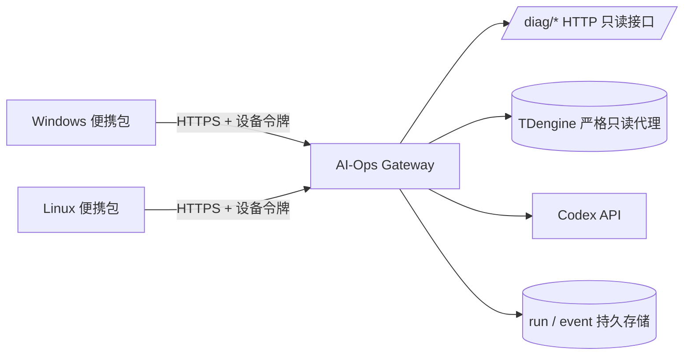

# AI-Ops Gateway 架构与部署

## 目标

便携包只负责客户端交互和进度显示。固定服务器上的 Gateway 才负责 `/diag/*` HTTP 查询、TDengine 直连代理、SSH 隧道、Codex provider、运行状态和事件存储。



客户端永远不接触数据库密码、SSH 私钥或 provider API key。订单、费用、设备和 Redis 队列证据经 `/diag/*` HTTP 读取，TDengine 仍走严格只读代理；Phase 3a 后服务器私有 `production.env` 不再保存 MySQL / Redis 直连凭据。

## 行业依据

- [NIST SP 800-207 Zero Trust Architecture](https://csrc.nist.gov/pubs/sp/800/207/final)：不能因为设备位于某个网络就隐式信任；用户和设备必须在访问资源前分别认证和授权。
- [RFC 8628 OAuth 2.0 Device Authorization Grant](https://www.rfc-editor.org/rfc/rfc8628)：适合无浏览器或输入受限的设备，通过另一台设备完成一次性授权。
- [RFC 8705 OAuth mTLS](https://www.rfc-editor.org/rfc/rfc8705)：生产环境可使用证书绑定令牌，避免被复制的 bearer token 被重放。
- [OWASP Secrets Management Cheat Sheet](https://cheatsheetseries.owasp.org/cheatsheets/Secrets_Management_Cheat_Sheet.html)：集中管理、最小权限、自动轮换和秘密使用审计。
- [HashiCorp Vault Database Secrets Engine](https://developer.hashicorp.com/vault/docs/secrets/databases)：优先为数据库访问签发短期动态凭据，而不是在客户端分发长期密码。
- [Microsoft Credential Locker](https://learn.microsoft.com/en-us/windows/apps/develop/security/credential-locker) 与 [Freedesktop Secret Service](https://specifications.freedesktop.org/secret-service-spec/latest/)：客户端令牌应进入操作系统凭据库，而不是明文配置或漫游文件。
- [Temporal Durable Execution](https://docs.temporal.io/temporal)：跨机器和故障恢复需要持久事件历史；本项目 MVP 先用 SQLite/WAL 事件表，接口预留 PostgreSQL/Temporal 演进空间。

## 当前实现

### 服务端

`aiops-gateway` 提供：

- `GET /health`：非敏感健康检查。
- `POST /v1/enroll`：兑换一次性高熵注册码，注册码只能使用一次。
- `POST /v1/runs`：创建只读诊断 run，真实执行发生在 Gateway 所在服务器。
- `GET /v1/runs`、`GET /v1/runs/{run_id}`：按 workspace 隔离的 run 查询。
- `GET /v1/runs/{run_id}/events`：按 sequence 增量同步事件。
- `GET /v1/runs/{run_id}/events/stream`：SSE 实时同步事件。
- `GET /v1/runs/{run_id}/evidence`：按 run 返回脱敏证据元数据（工具、状态、请求骨架、行数、错误），不含业务正文。
- `GET /v1/orders/{order_no}/access`：标准 Bearer token 的订单授权探针；只返回
  `order_no`、可访问标记和范围指纹，不返回订单正文。该端点是后续标准健康报告与
  单问诊断 API 的认证 tracer bullet。

### 标准资源 API 认证

标准资源接口与既有 `aops_*` 设备接口并存，二者不能互换。标准接口只接受
`Authorization: Bearer <access_token>`，通过可配置的 caller-context resolver 建立
不可变 `ScopeContext`，再复用现有 `QueryScope` 与 `ScopedSources` 做订单范围校验。
请求中的裸 `user_id`、`tenant_id`、设备令牌或内部 HMAC 都不能扩大授权范围。

第一版提供 OAuth 2.0 token introspection 适配器：验证 `active`、`sub`、租户、
AI-Ops audience、过期时间、required scope 和业务数据范围。资源接口只依赖 resolver
协议，未来可在引入经过批准的 JOSE 依赖后增加 JWT 验签实现，不手写不完整的 JWT
签名校验。

```env
AIOPS_GATEWAY_INTROSPECTION_URL=https://auth.example.com/oauth2/introspect
AIOPS_GATEWAY_INTROSPECTION_CLIENT_ID=aiops
AIOPS_GATEWAY_INTROSPECTION_CLIENT_SECRET=REDACTED
AIOPS_GATEWAY_STANDARD_API_AUDIENCE=aiops-api
AIOPS_GATEWAY_INTROSPECTION_TIMEOUT_SECONDS=5
```

未配置 introspection 时，既有设备接口照常工作，标准资源接口以稳定 503 错误
`ACCESS_TOKEN_VALIDATION_UNAVAILABLE` fail closed。远程 introspection endpoint 必须使用
HTTPS；client secret 不得进入便携包、日志或 API 响应。

### C 端 `thirdSession` 委托适配

小程序的 `thirdSession` 只在 Java 业务后端验证，并不会传给 AI-Ops。Java 为当前请求签发
短生命周期、一次性不透明句柄，通过独立服务身份调用标准 API，并在
`X-AIOps-Delegation` 请求头中携带该句柄。Gateway 通过私有回查接口原子兑换句柄，映射为
现有 `ScopeContext` 后再执行订单范围校验。

委托配置只存在 Gateway 和 Java 服务端私有运行配置中：

```env
AIOPS_GATEWAY_DELEGATION_REDEMPTION_URL=https://business.example.com/internal/aiops/delegations/redeem
AIOPS_GATEWAY_DELEGATION_CALLER_TOKEN=REDACTED
AIOPS_GATEWAY_DELEGATION_REDEMPTION_TOKEN=REDACTED
AIOPS_GATEWAY_DELEGATION_SERVICE_ID=java-bff
AIOPS_GATEWAY_DELEGATION_TIMEOUT_SECONDS=5
```

委托句柄不是 OAuth token，也不是 `user_id`/`tenant_id` 的替代字段；客户端不得取得或构造
它。没有完整配置时适配器 fail closed，不回退到设备 token 或裸身份。

服务端 SQLite 只保存注册码哈希、设备令牌哈希、run 元数据、脱敏结果和事件元数据，不保存原始 API key。证据正文仍保留在服务器私有 run workspace，不通过 Gateway 事件接口暴露。

当前 MVP 的注册码由服务器管理员本地签发：

```bash
# 工作区级注册（推荐）：不传 --tenant-id，注册后的设备可诊断任意订单，
# 由 order_snapshot 按订单号自动发现租户。适合可信内部运维团队。
uv run aiops-gateway issue-enrollment --workspace ops
uv run aiops-gateway serve
```

`--tenant-id` 是可选的：不传即工作区级（设备不绑定租户，任意订单可查）；仅当需要把某台设备限制到单一租户时才传（例如多外部运营商必须互不可见的场景）。诊断时运维只需提交订单号，无需查找或输入租户——`order_snapshot` 会按 `order_no` 发现订单及其租户。

Gateway 进程通过 `AIOPS_GATEWAY_SERVER_CONFIG_FILE` 加载服务器私有 `production.env`。该文件只应存在于固定服务器，不应复制到便携包；Phase 3a 后其中只保留 `/diag/*` HTTP 内部令牌、TDengine 直连代理、provider key 和 Gateway 配置。

用户级 systemd 服务必须显式固定应用配置和数据根目录，不能依赖用户管理器继承的通用 `XDG_CONFIG_HOME/XDG_DATA_HOME`。否则 key slot 可能错误解析到 `$XDG_CONFIG_HOME/keys`：

```env
AIOPS_CONFIG_HOME=/home/claude/.config/aiops-diagnostics
AIOPS_DATA_HOME=/home/claude/.local/share/aiops-diagnostics
AIOPS_GATEWAY_SERVER_CONFIG_FILE=/home/claude/.config/aiops-diagnostics/production.env
AIOPS_CODEX_KEY_SLOT=psydo-primary
```

### Model provider

Gateway 在服务端运行 Codex session，因此 provider 选择是服务端行为：切换默认 provider
后，已注册的 Windows 客户端立即生效，无需重新打包。在 `production.env` 中配置多 provider
注册表，默认 provider 用于每次 `remote diagnose`：

```env
AIOPS_PROVIDERS=glm-ark,gpt-psydo
AIOPS_DEFAULT_PROVIDER=glm-ark
AIOPS_PROVIDER_GLM_ARK_BASE_URL=https://ark.cn-beijing.volces.com/api/coding/v3/
AIOPS_PROVIDER_GLM_ARK_MODEL=glm-5-2-260617
AIOPS_PROVIDER_GLM_ARK_KEY_SLOT=glm-ark
AIOPS_PROVIDER_GPT_PSYDO_BASE_URL=https://api.psydo.top/
AIOPS_PROVIDER_GPT_PSYDO_KEY_SLOT=psydo-primary
```

`AIOPS_GATEWAY_ALLOWED_KEY_SLOTS` 必须包含每个 provider 的 key slot。客户端可用
`remote diagnose --provider gpt-psydo` 按运行切换 fallback provider；不传则用默认。
`agent-doctor --provider <name>` 可单独验证某个 provider 的 key 与 runtime。

### 客户端

新电脑只需一次注册：

```powershell
.\aiops.exe remote enroll --url https://aiops.example.com --code-file C:\secure\gateway-enrollment.code
.\aiops.exe remote doctor
.\aiops.exe remote runs
.\aiops.exe remote diagnose "订单 123 金额异常" --json
.\aiops.exe remote evidence RUN_ID
```

`order_snapshot` 按 `order_no` 发现订单并从订单行学习 tenant，再校验是否在设备授权租户内；不匹配时返回明确的租户范围错误而非空结果。诊断结果与证据默认用中文输出；`remote evidence RUN_ID` 列出每条证据的工具、状态、命中行数和错误，用于追溯结论来源（证据正文仍只在服务端）。

Windows `cmd.exe` 示例（便携包解压到 `D:\aiops`）：

```cmd
cd /d D:\aiops
dir D:\gateway-enrollment-ops.code
aiops.exe remote enroll --url https://aiops.example.com --code-file D:\gateway-enrollment-ops.code
aiops.exe remote doctor
aiops.exe remote runs
aiops.exe remote diagnose "订单 123 金额异常" --json
```

注册码只能兑换一次。若文件名或路径不正确，客户端会在本地文件检查阶段返回 `File ... does not exist`，此时注册码尚未被兑换；使用 `dir` 检查实际文件名后重试。也可以省略 `--code-file`，让客户端隐藏提示输入注册码。注册成功后删除本地注册码文件，不要再次运行 `remote enroll`。

注册后，客户端只保存 Gateway URL、设备 ID、workspace ID 等 profile，以及设备令牌。令牌优先使用 Windows Credential Locker / Linux Secret Service，通过 `keyring` 访问；没有系统凭据库时才回退到当前用户私有文件，并保留 `0600/Windows DACL` 校验。

同一 workspace 的 Windows 和 Linux 设备查询同一套 run/event 数据，因此换设备后仍能用 `remote runs`、`remote show` 和 `remote events` 查看进度。

`remote doctor` 只调用公开的 `/health` liveness 接口，不证明设备令牌仍有效；要验证注册后的身份，请执行 `remote runs`。诊断出现 `interrupted` 或 `failed` 时，`remote show RUN_ID` 会显示脱敏的 `error_type` 和 `error_message`，`remote events RUN_ID --after 0` 可追溯排队、worker 启动、provider 调用和中断原因。

## 安全边界

- ZIP 不包含数据库凭据、SSH 私钥、provider key 或 Gateway bearer token。
- 客户端不能提交任意 provider URL、任意数据库查询、任意 fixture 路径或业务动作。
- 设备注册 code 和设备 token 只在传输/兑换时出现，服务端只存 SHA-256 哈希。
- 租户绑定在注册码上；设备请求其他租户时被拒绝。
- 标准资源接口验证 access token 的 audience、有效期和 required scope，并按不可变
  调用者范围重新查询订单；知道订单号或资源 ID 不能单独获得访问权。
- 服务端 key slot 通过 `AIOPS_GATEWAY_ALLOWED_KEY_SLOTS` 白名单限制，恢复和执行仍比较固定 provider endpoint。
- Gateway 只同步状态和证据 ID 等元数据，不同步 evidence payload、密码或内部绝对路径。
- run 元数据中的用户反馈会在服务端持久化前脱敏；客户端 `show` 只得到诊断合同结果，不得到服务器证据正文。

## 生产硬化要求

当前代码是可运行的单节点 Gateway MVP，不应直接暴露到公网。正式部署前必须完成：

1. 在 Nginx/Traefik 或云负载均衡后启用 TLS，Gateway 只监听 loopback 或内网地址。
2. 把一次性注册码替换为企业 OIDC Device Flow；高安全环境增加 mTLS 或证书绑定 token。
3. 用 Vault/KMS 管理服务端数据库和 provider key，数据库账号改为短期动态凭据；不把长期密码放在客户端环境变量。
4. 将 SQLite/WAL 替换为 PostgreSQL，并为事件表、workspace、device、revocation 和审计日志建立备份与保留策略。
5. 增加反暴力、速率限制、设备撤销、密钥轮换、审计导出和管理员审批。
6. 需要跨节点 durable worker 时再引入 Temporal；第一版不把 Temporal 作为便携包运行时依赖。

这些硬化完成前，Gateway 仅适合内网、测试和受控工程师验收，不宣称已经完成生产多租户认证。
